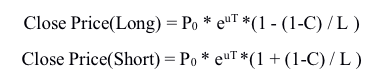

# Contracts

NEST offers a variety of contract functions based on probabilistic assets, with which developers can quickly build their own DeFi, NFT, and GameFi projects.

The contract functions already available are futures, options and roll.

## Futures

The Futures contract includes four functions:
- Buy futures
- Sell futures
- Futures liquidation
- Get futures index

### Buy Futures

The Buy Futures function allows users to buy a future product with the specific leverage ratio, direction and amount, without a trading fee. Users could open a future position of ETH/USDT or BTC/USDT directly through their wallet. The market price of futures is provided by the NEST oracle.

Futures' open price will be slightly different from the price provided by the NEST oracle, as the mechanism of the decentralized oracle will result in a little time lag between market price and the oracle price, thus, a certain amount of risk compensation is added to the futures' open price. For example, for long positions, the open price will be slightly higher than the price quoted by the NEST oracle.

```
    function buy(
        address tokenAddress,
        uint lever,
        bool orientation,
        uint nestAmount
    ) external payable override
```

|Input|type|Detail|
|---|---|---|
|tokenAddress|address|Target token address, 0 means eth|
|lever|uint|Lever of future|
|orientation|bool|true: call, false: put|
|nestAmount|uint|Amount of paid NEST|

### Sell Future

When already having a NEST futures position, users could use the sell function to sell a futures position of any amount. Of course, the amount sold could not exceed the position held.

```
    function sell(uint index, uint amount) external payable override
```

|Input|type|Detail|
|---|---|---|
|index|uint|Index of future|
|amount|uint|Amount to sell|

### Futures Liquidation

Futures contracts are cleared using a position-by-position mechanism, which means that each position in a futures contract is cleared independently. When the margin on a futures contract position falls below the liquidation price, a liquidator will liquidate it. Anyone can become a liquidator of NEST and the liquidator receives the residual value of the contract after it has been liquidated.

The liquidation price of a futures contract is calculated as follows.

NEST futures are using the isolated margin mode, which means each futures position is liquidated independently. When the margin on a futures position falls below the liquidation price, the liquidator will liquidate it. Anyone could become the liquidator of NEST and the liquidator receives the residual value of the contract after it has been liquidated.

The liquidation price of a futures contract is calculated as follows.



- P0: Futures open price
- L: Leverage ratio
- C: Liquidation rate
- T: Position holding time
- u: Risk free rate in NEST network

```
    function settle(uint index, address[] calldata addresses) external payable override
```

|Input|type|Detail|
|---|---|---|
|index|uint|Index of future|
|addresses|address[]|Target addresses|

### Get Futures Index

Futures index contains leverage and direction information of the futures contract, and it can be used as an input parameter in other functions.

```
    function getFutureInfo(
        address tokenAddress, 
        uint lever,
        bool orientation
    ) external view override returns (FutureView memory)
```

|Input|type|Detail|
|---|---|---|
|tokenAddress|address|Target token address, 0 means eth|
|lever|uint|Lever of future|
|orientation|bool|true: call, false: put|

|Output|type|Detail|
|---|---|---|
|index|uint|future index|
|tokenAddress|address|Target token address, 0 means eth|
|lever|uint|Lever of future|
|orientation|bool|true: call, false: put|

## Options

Options contracts include four functions:
- Buy options
- Exercise options
- Sell options
- Find options

### Buy Options

NEST provides infinite European options for users. Users could buy a NEST option without any commission. Most options market markers only have several expiry dates and strike amounts for users to choose, but NEST options ' expiry date and strike price are set by the user, which is much more flexible.

```
    function open(
        address tokenAddress,
        uint strikePrice,
        bool orientation,
        uint exerciseBlock,
        uint nestAmount
    ) external payable override
```

|Input|type|Detail|
|---|---|---|
|tokenAddress|address|Target token address, 0 means eth|
|strikePrice|uint|The exercise price set by the user. During settlement, the system will compare the current price of the subject matter with the exercise price to calculate the user's profit and loss|
|orientation|bool|true: call, false: put|
|exerciseBlock|uint|After reaching this block, the user will exercise manually, and the block will be recorded in the system using the block number|
|nestAmount|uint|Amount of paid NEST|

### Exercise Option

When there is already an option position and the option has expired, the user can choose to exercise the option at any subsequent time if the final payoff is greater than 0

```
    function exercise(uint index, uint amount) external payable override
```

|Input|type|Detail|
|---|---|---|
|index|uint|Index of option|
|amount|uint|Amount of option to exercise|

### Sell Option

When there is already an option position and the option has not expired, the user could call the sell function and sell the option to the NEST network, and thereby receive an immediate gain.

```
    function sell(uint index, uint amount) external payable override
```

|Input|type|Detail|
|---|---|---|
|index|uint|Index of option|
|amount|uint|Amount of option to sell|

### Find the Options

The find function allows users to find the options order data for a specific address.

```
    function find(
        uint start, 
        uint count, 
        uint maxFindCount, 
        address owner
    ) external view override returns (OptionView[] memory optionArray)
```

|Input|type|Detail|
|---|---|---|
|start|uint|Given the order index of the address, and it will return all the options bought after this given order.|
|count|uint|Maximum number of records returned|		
|maxFindCount|uint|Find records at most|
|owner|address|Target address|

|Output|type|Detail|
|---|---|---|
|index|uint|Option index|
|tokenAddress|address|address Target token address, 0 means eth|
|strikePrice|uint|The price set by the user. The system will compare the current price with the strike price to calculate the user's profit and loss|
|orientation|bool|True: call, False: put|
|exerciseBlock|uint|After reaching this block, the user will exercise manually, and the block will be recorded in the system using the block number|
|balance|uint|Option shares|
|owner|address|Target address|

## Roll

Using the Roll function, users can play directly with the NEST network using NEST tokens.

### Start a Roll

By entering an amount and a multiplier, the user can make a roll with a probability of winning = 1/multiplier, with limits between 1.1 and 100 for multipliers and between 1 and 1000 NEST for amounts.

```
    function roll44(uint n, uint m) external override
```

|Input|type|Detail|
|---|---|---|
|n|uint|count of NEST|
|m|uint|times, 4 decimals|

### Find the Roll Information

By calling the find44 function, users can find all order information for an address, including the winning amount.

```
    function find44(
        uint start, 
        uint count, 
        uint maxFindCount, 
        address owner
    ) external view override returns (DiceView44[] memory diceArray44)
```

|Input|type|Detail|
|---|---|---|
|start|uint|Given the order index of the address, and it will return all the roll orders after this given order.|
|count|uint|Maximum number of records returned|
|maxFindCount|uint|Find records at most|
|owner|address|Target address|

|Output|type|Detail|
|---|---|---|
|index|uint|Roll index|
|owner|address|Target address|
|n|uint32|NEST amount|
|m|uint32|Multiplier, 4 decimals|
|openBlock|uint32|The block number of the roll|
|gained|uint|Winning NEST amount|

### Claim NEST

By calling the Claim function, it could settle a roll order that the result is win,  and send the winning NEST amount to the roll address.

```
    function claim44(uint index) external override
```

|Input|type|Detail|
|---|---|---|
|index|uint|index of bet|