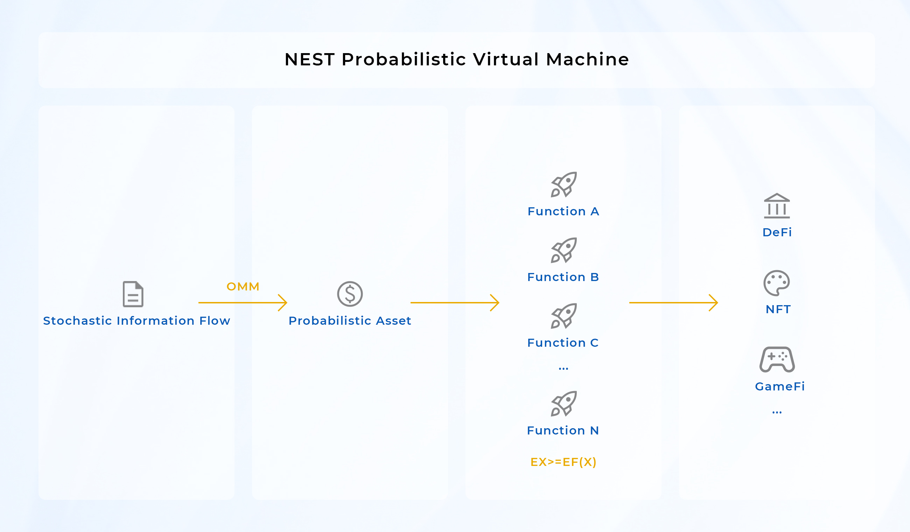

# Mechanism

NEST is a decentralised probabilistic virtual machine (PVM) model that provides developers with probabilistic assets on the chain and helps developers to quickly build projects such as DeFi, NFT, GameFi, etc. through various contract functions.

## NEST PVM

