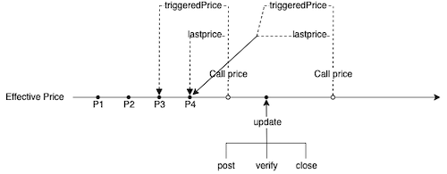
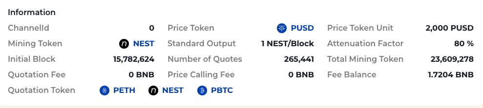

# API Calls

Anyone can call the prices in NEST oracle. The NEST oracle prices can be called by the following steps:

1. Calling the corresponding price contract
2. Calling the functions in the contract

## Definitions

### ChannelId and TokenPair Index

Anyone can create an oracle channel. A channel could have multiple token pair prices for quotation, and these token pairs all have the same base currency. The token pair index refers to the tokenPair price on the channel. It is similar to a two-dimensional array that locates the price by channelId and pairIndex.

### Price Calling Fee

Each call of the contract needs a calling fee. This calling fee is decided by the administrator of the channel. Currently, the calling fee of channel 0 is zero.

| Network  | Fee  |
| -------- | ---- |
| Ethereum | 0ETH |
| BNB      | 0BNB |

### Triggered Price and Last Price

The effective price on NEST oracle can be updated in three ways:

1. Post a new price.
2. Verify the current price and post a new price.
3. Close the current price.

If the effective price is updated, which is the most common case, the triggered price and the last price are the same. However, if the effective price is not updated, then, the last price is the most recent effective price, and the triggered price is the price just before this last price. The difference between the triggered price and the last price is the triggered price requires less gas consumption.



### Price Token and Price Token Unit

Price token unit is the minimum collateral amount for a price quote. Each channel has its own Price token and Price token unit, please check it before calling.

[Channel Information Website](https://channel.nestprotocol.org/)

### Front-end Display Prices

NEST oracle provides price data dominated in Price Token Unit. Users should convert this price to the normal price format for front-end display.

For example, ETH is the quotation token, the NEST oracle will provide the ETH price data as "800000000000000000", having 18 zeros, which means 2000 USDT = 0.8ETH, and convert to the normal price format should be 1 ETH = 2500 USDT.



## Price Contracts

The NEST oracle provides token pair prices on ETH and BSC chains.

### Ethereum

| Network | Contract Address                           |
| ------- | ------------------------------------------ |
| Mainnet | 0xE544cF993C7d477C7ef8E91D28aCA250D135aa03 |
| Rinkeby | 0xc08e6a853241b9a08225eecf93f3b279fa7a1be7 |

### BNB

| Network | Contract Address                           |
| ------- | ------------------------------------------ |
| BNB     | 0x09CE0e021195BA2c1CDE62A8B187abf810951540 |
| Test    | 0xF2f9E62f52389EF223f5Fa8b9926e95386935277 |

## Functions

The following functions in the contract can be used not only to look up prices, but also to make strategies for mining.

### Get the Latest Triggered Price

The NEST price is a weighted average of all prices in the same block. New quotes and close operations trigger the calculation of prices that are already in effect earlier, while volatility and historical average prices are calculated.

```
function triggeredPrice(
    uint channelId,
    uint[] calldata pairIndices,
    address payback
) external payable returns (uint[] memory prices);
```

| input       | type    | instruction                                                                                    |
| ----------- | ------- | ---------------------------------------------------------------------------------------------- |
| channelId   | uint    | Target channelId                                                                               |
| pairIndices | uint[]  | Array of pair indices                                                                          |
| payback     | address | Address to receive refund                                                                      |
| output      | type    | instruction                                                                                    |
| prices      | uint[]  | Price array, i _ 2 is the block where the ith price is located, and i _ 2 + 1 is the ith price |

### Get Full Information of the Latest Triggered Price

Get the latest triggered price and average price volatility information.

```
function triggeredPriceInfo(
    uint channelId,
    uint[] calldata pairIndices,
    address payback
) external payable returns (uint[] memory prices);
```

| input       | type    | instruction               |
| ----------- | ------- | ------------------------- |
| channelId   | uint    | Target channelId          |
| pairIndices | uint[]  | Array of pair indices     |
| payback     | address | Address to receive refund |

| output | type   | instruction                                                                                                                                                        |
| ------ | ------ | ------------------------------------------------------------------------------------------------------------------------------------------------------------------ |
| prices | uint[] | Price array, i _ 4 is the block where the ith price is located, i _ 4 + 1 is the ith price, i _ 4 + 2 is the ith average price and i _ 4 + 3 is the ith volatility |

### Find Historical Prices

Find the effective price on the target historical block, and if there is no price on the target block, find the previous effective price.

```
function findPrice(
    uint channelId,
    uint[] calldata pairIndices,
    uint height,
    address payback
) external payable returns (uint[] memory prices);
```

| input       | type    | instruction               |
| ----------- | ------- | ------------------------- |
| channelId   | uint    | Target channelId          |
| pairIndices | uint[]  | Array of pair indices     |
| height      | uint    | Destination block number  |
| payback     | address | Address to receive refund |

| output | type   | instruction                                                                                    |
| ------ | ------ | ---------------------------------------------------------------------------------------------- |
| prices | uint[] | Price array, i _ 2 is the block where the ith price is located, and i _ 2 + 1 is the ith price |

### Get the Effective Prices List

Get the historical effective prices list, users could customise the number of prices returned.

```
function lastPriceList(
    uint channelId,
    uint[] calldata pairIndices,
    uint count,
    address payback
) external payable returns (uint[] memory prices);
```

| input       | type    | instruction                               |
| ----------- | ------- | ----------------------------------------- |
| channelId   | uint    | Target channelId                          |
| pairIndices | uint[]  | Array of pair indices                     |
| count       | uint    | The number of prices needs to be returned |
| payback     | address | Address to receive refund                 |

| output | type   | instruction                                                                                             |
| ------ | ------ | ------------------------------------------------------------------------------------------------------- |
| prices | uint[] | Result array, I _ count _ 2 to (i + 1) _ count _ 2 - 1 are the price results of group I quotation pairs |

### Return the Last Price and Triggered Price

Return the last price list and the triggered price information.

```
function lastPriceListAndTriggeredPriceInfo(
    uint channelId,
    uint[] calldata pairIndices,
    uint count,
    address payback
) external payable returns (uint[] memory prices);
```

| input       | type    | instruction                               |
| ----------- | ------- | ----------------------------------------- |
| channelId   | uint    | Target channelId                          |
| pairIndices | uint[]  | Array of pair indices                     |
| count       | uint    | The number of prices needs to be returned |
| payback     | address | Address to receive refund                 |

| output | type   | instruction                                                                                                                                                    |
| ------ | ------ | -------------------------------------------------------------------------------------------------------------------------------------------------------------- |
| prices | uint[] | Return the quotation pair's prices and information, which are the last price list, triggered price block number, triggered price, average price and volatility |

### Off-Chain Price Calls

For some scenarios, it may be necessary to call prices off the chain, the off-chain price calling could use the functions in the following link.

[https://etherscan.io/address/0xE544cF993C7d477C7ef8E91D28aCA250D135aa03#readProxyContract](https://etherscan.io/address/0xE544cF993C7d477C7ef8E91D28aCA250D135aa03#readProxyContract)

The correspondence between the off-chain call functions and the on-chain call functions is as follows.

| Off-Chain Function                 | On-Chain Function                                  |
| ---------------------------------- | -------------------------------------------------- |
| triggeredPrice                     | Get the Latest Triggered Price                     |
| triggeredPriceInfo                 | Get Full Information of the Latest Triggered Price |
| findPrice                          | Find Historical Prices                             |
| lastPriceList                      | Get the Effective Prices List                      |
| lastPriceListAndTriggeredPriceInfo | Return the Last Price and Triggered Price          |

## API Calls Examples

The following examples use the ethereum rinkeby test network.

- Contract:0xc08e6a853241b9a08225eecf93f3b279fa7a1be7
- ChannelId:0
- Fee:0

| Token | Address                                    | PairIndex |
| ----- | ------------------------------------------ | --------- |
| HBTC  | 0xaE73d363Cb4aC97734E07e48B01D0a1FF5D1190B | 0         |
| ETH   | 0x0000000000000000000000000000000000000000 | 1         |
| NEST  | 0xE313F3f49B647fBEDDC5F2389Edb5c93CBf4EE25 | 2         |

### Use Instant Price

```
    // Query latest 2 price
    function _lastPriceList(
        TokenConfig memory tokenConfig,
        uint fee,
        address payback
    ) internal returns (uint[] memory prices) {

        // -----GET NEST PRICE-----
        prices = INestBatchPrice2(NEST_OPEN_PRICE).lastPriceList {
            value: fee
        } (uint(tokenConfig.channelId), _pairIndices(uint(tokenConfig.pairIndex)), 2, payback);
        // -----GET NEST PRICE-----

        prices[1] = _toUSDTPrice(prices[1]);
        prices[3] = _toUSDTPrice(prices[3]);
    }

    // Query latest price
    function _latestPrice(
        TokenConfig memory tokenConfig,
        uint fee,
        address payback
    ) internal returns (uint oraclePrice) {

        // -----GET NEST PRICE-----
        uint[] memory prices = INestBatchPrice2(NEST_OPEN_PRICE).lastPriceList {
            value: fee
        } (uint(tokenConfig.channelId), _pairIndices(uint(tokenConfig.pairIndex)), 1, payback);
        // -----GET NEST PRICE-----

        oraclePrice = _toUSDTPrice(prices[1]);
    }

    // Find price by blockNumber
    function _findPrice(
        TokenConfig memory tokenConfig,
        uint blockNumber,
        uint fee,
        address payback
    ) internal returns (uint oraclePrice) {

        // -----GET NEST PRICE-----
        uint[] memory prices = INestBatchPrice2(NEST_OPEN_PRICE).findPrice {
            value: fee
        } (uint(tokenConfig.channelId), _pairIndices(uint(tokenConfig.pairIndex)), blockNumber, payback);
        // -----GET NEST PRICE-----

        oraclePrice = _toUSDTPrice(prices[1]);
    }
```

### Use the Average Price

```
    /// @dev Get price
    /// @param token mortgage asset address
    /// @param uToken underlying asset address
    /// @param payback return address of excess fee
    /// @return tokenPrice Mortgage asset price(2000U = ? token)
    /// @return pTokenPrice PToken price(2000U = ? pToken)
    function getPriceForPToken(
        address token, 
        address uToken,
        address payback
    ) public payable override returns (
        uint256 tokenPrice, 
        uint256 pTokenPrice
    ) {
        if(uToken == address(USDT_ADDRESS)) {
            uint256[] memory pricesIndex = new uint256[](1);
            pricesIndex[0] = addressToPriceIndex[token];

            // -----GET NEST PRICE-----
            uint256[] memory prices = _nestBatchPlatform.triggeredPriceInfo{value:msg.value}(CHANNELID, pricesIndex, payback);
            // -----GET NEST PRICE-----

            require(prices[2] > 0, "Log:PriceController:!avg");
            return(prices[2], BASE_USDT_AMOUNT);
        } else {
            uint256[] memory pricesIndex = new uint256[](2);
            pricesIndex[0] = addressToPriceIndex[token];
            pricesIndex[1] = addressToPriceIndex[uToken];

            // -----GET NEST PRICE-----
            uint256[] memory prices = _nestBatchPlatform.triggeredPriceInfo{value:msg.value}(CHANNELID, pricesIndex, payback);
            // -----GET NEST PRICE-----

            require(prices[2] > 0 && prices[6] > 0, "Log:PriceController:!avg");
            return(prices[2], prices[6]);
        }
    }

```

### Decrease Price Fluctuations

Sometimes the market prices fluctuate wildly . There are some precautions to decrease the unwanted sharply fluctuations. For example, stop trading when the deviation between instant price and the average price is beyond a certain threshold.

```
    /// @dev Query latest price info
    /// @param tokenAddress Target address of token
    /// @param payback As the charging fee may change, it is suggested that the caller pay more fees, 
    /// and the excess fees will be returned through this address
    /// @return blockNumber Block number of price
    /// @return priceEthAmount Oracle price - eth amount
    /// @return priceTokenAmount Oracle price - token amount
    /// @return avgPriceEthAmount Avg price - eth amount
    /// @return avgPriceTokenAmount Avg price - token amount
    /// @return sigmaSQ The square of the volatility (18 decimal places)
    function latestPriceInfo(address tokenAddress, address payback) 
    external 
    payable 
    override
    returns (
        uint blockNumber, 
        uint priceEthAmount,
        uint priceTokenAmount,
        uint avgPriceEthAmount,
        uint avgPriceTokenAmount,
        uint sigmaSQ
    ) {

        // -----GET NEST PRICE-----
        (
            blockNumber, 
            priceTokenAmount,
            ,//uint triggeredPriceBlockNumber,
            ,//uint triggeredPriceValue,
            avgPriceTokenAmount,
            sigmaSQ
        ) = INestPriceFacade(NEST_PRICE_FACADE).latestPriceAndTriggeredPriceInfo { 
            value: msg.value 
        } (tokenAddress, payback);
        // -----GET NEST PRICE-----
        
        _checkPrice(priceTokenAmount, avgPriceTokenAmount);
        priceEthAmount = 1 ether;
        avgPriceEthAmount = 1 ether;
    }
```